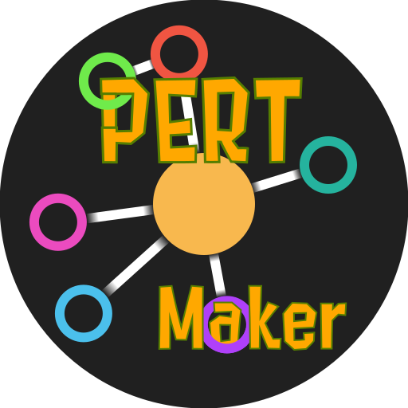

<h1 align="center"> PERT Maker: Build PERT Charts with Ease</h1>

  
  
  
  

----------------------------------------------------------------------

PERT Maker is a simple tool to create <a href="https://en.wikipedia.org/wiki/Program_evaluation_and_review_technique">PERT charts</a>. It is written in Python and uses the PySide framework.

## Requirements

### Windows

- Windows 7 or later
- VC++ 2015 Redistributable

### Source Code
- Python 3.11 or later
  - Dependencies (use `pip install -r requirements.txt` in the project root folder to install them)

## Installation

### Windows

- Download the latest release from the [releases page](https://github.com/Synell/PERT-Maker/releases) and extract it to a folder of your choice.

## Customization

### Language

- You can customize the language of the app by adding a new file into the `/data/lang/` folder. The language must be a valid [JSON](https://en.wikipedia.org/wiki/JavaScript_Object_Notation) code. If the language is not supported, the app will default to English. Then, you can change the language in the settings menu.

  *See [this file](https://github.com/Synell/PERT-Maker/blob/main/data/lang/english.json) for an example.*

### Theme

- You can customize the theme of the app by adding new files into the `/data/themes/` folder. The theme must be contain valid [JSON](https://en.wikipedia.org/wiki/JavaScript_Object_Notation) codes and valid [QSS](https://doc.qt.io/qt-6/stylesheet-reference.html) codes. If the theme is not supported, the app will default to the default theme. Then, you can change the theme in the settings menu.

  *See [this file](https://github.com/Synell/PERT-Maker/blob/main/data/themes/neutron.json) and [this folder](https://github.com/Synell/PERT-Maker/tree/main/data/themes/neutron) for an example.*

## Usage

### Creating a PERT Chart

By default, a new PERT chart is created when you start the app. You can create a new PERT chart by clicking on the "New" button in the "File" toolbar.

To start making a PERT chart, you need to add some nodes. You can add a node by right-clicking on the canvas. There, you can edit the properties of the node in the "Properties" tab.

To select a node, you can left-click on it. To delete a node, you need to select it and press the "Delete" key on your keyboard.

*Nodes can be moved by left-clicking on them and dragging them to the desired position.*

 

To connect two nodes, you need to select the first node and then right-click on the second node. There, you can edit the properties of the connection in the "Properties" tab.

*You can link existing nodes by right-clicking on an existing node as you second node.*

 

Nodes have properties that can be edited in the "Properties" tab. You can edit the properties of a node by selecting it. You can edit the display name, the minimum time to do the task and the maximum time to do the task.

If the node is pointing to another node, you can edit the display name of the connection and the time to do the task.

 

Let's say you have this PERT chart:

Let's focus on the "Generation" tab:

You can see that we have 3 buttons.

*Note that each toggle switch next to a button has the function to, when activated, enable or disable the live refresh of the corresponding button so you don't have to manually press the button. It can be useful if you want to see the result of a change in real time but it can quickly take a lot of resources if you have a lot of nodes.*

#### Refresh Connection View

Before clicking on the "Refresh Connection View" button, the connections are not displayed in the "Connection View" tab.

After clicking on the "Refresh Connection View" button, the connections are displayed as a table in the "Connection View" tab.

#### Generate Min and Max Times

Before clicking on the "Generate Min and Max Times" button, the minimum and maximum times are not set on our PERT chart. You could set them manually, but it's a lot of work. So, we can use the "Generate Min and Max Times" button to automatically set the minimum and maximum times.

After clicking on the "Generate Min and Max Times" button, the minimum and maximum times are set on our PERT chart.

#### Generate Critical Path

Before clicking on the "Generate Critical Path" button, the critical path is not displayed in the "Critical Path" tab.

After clicking on the "Generate Critical Path" button, the critical path is displayed as a table in the "Critical Path" tab.

 

The last toggle switch, as its name suggests, allows you to use the node names instead of the node IDs in the "Connection View" and "Critical Path" tabs.

*Note that the chart will not look the same after checking this toggle switch.*

 

### Exporting the PERT Chart

You can export the PERT chart as an image or as a vectorial image (SVG) by clicking on the "Export" button, then on the "Image" button, in the "File" tab.

There, you can choose the file location, the file name, the background color and the foreground color.

### Generate a PERT Chart from a CSV file

You can generate a PERT chart from a CSV file by clicking on the "Import" button, then on the "Table" button, in the "File" tab.

There, you can choose the file to load or set manually the data.

### Exporting the PERT Chart as a CSV file

You can export the PERT chart as a CSV file by clicking on the "Export" button, then on the "Table" button, in the "File" tab.
